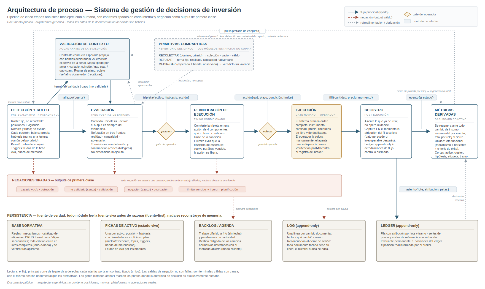

# Sistema de gestión de decisiones de inversión

### Whitepaper de arquitectura de proceso

> **Documento público.** Este documento describe la arquitectura de proceso de un sistema personal de gestión de decisiones sobre un portafolio de inversión. El foco es el **diseño de proceso**: separación de funciones, contratos entre módulos, gates de decisión, generación y consumo de información, y automatizaciones. **Todos los ejemplos, activos, cifras y fechas de esta documentación son ficticios y están rotulados como tales.** No contiene posiciones, montos, plataformas ni operaciones reales.



*Diagrama completo en [`docs/architecture.svg`](docs/architecture.svg) · Esquema de los dispositivos de análisis en [`docs/dispositivos.svg`](docs/dispositivos.svg) · Flujo paso a paso con skills y fórmulas en [`docs/flujo-detallado.svg`](docs/flujo-detallado.svg) · Caso de uso ficticio de punta a punta en [`docs/case-study.md`](docs/case-study.md) · Especificación resumida (PDF, 8 láminas) en [`docs/especificacion-resumen.pdf`](docs/especificacion-resumen.pdf) · Nota técnica «El Heredero y el Kernel» — modo a prueba de fallos y separación método/configuración — en [`docs/nota-heredero-kernel.pdf`](docs/nota-heredero-kernel.pdf).*

**Qué mirar primero.** Con dos minutos: la [especificación resumida](docs/especificacion-resumen.pdf) — ocho láminas con la ficha técnica, los requisitos de diseño y los contratos del pipeline — o el [diagrama de arquitectura](docs/architecture.svg) junto a la tabla de [salvaguardas contra sesgos del operador (§6)](#6-salvaguardas-contra-sesgos-del-operador). Con diez: el [caso de uso de punta a punta](docs/case-study.md), que sigue una jornada completa por el pipeline con dos hilos en paralelo, uno que termina en ejecución y otro en negación — ambos outputs válidos del mismo proceso —, y el [esquema de los dispositivos de análisis](docs/dispositivos.svg), que abre en detalle los dos módulos evaluativos: validación de contexto y evaluación. Para la capa de auditoría del propio sistema — el modo a prueba de fallos y el kernel —, la nota técnica [«El Heredero y el Kernel»](docs/nota-heredero-kernel.pdf). El resto del documento es la especificación: principios de diseño ([§2](#2-principios-de-diseño)), módulos y capas transversales ([§3](#3-módulos-del-pipeline)–[§4](#4-capas-transversales)), modelo de datos ([§5](#5-modelo-de-datos-del-registro)) y glosario ([§7](#7-glosario)).

---

## 1. Propósito

El sistema gobierna el ciclo completo de decisión sobre un portafolio de inversión operado en conjunto por un **operador humano** (autoridad de decisión única) y un **agente asistente de IA** (ejecuta los módulos de análisis, registro y métricas). No es un modelo predictivo ni una estrategia: es una **arquitectura de proceso**. El sistema no opina sobre el mercado; estructura *cómo* se decide, *qué* información se genera en cada paso, *quién* consume cada output y *qué* queda registrado.

El diseño responde a tres familias de problemas observadas en la operación real:

1. **Sesgos del operador bajo presión.** Las decisiones sobre capital se toman en contextos que activan sesgos conocidos y bien documentados: anclaje al precio de compra, efecto dotación sobre lo que ya se posee, persecución de movimientos de precio, impulsividad con el mercado abierto. Un proceso que no los ataca estructuralmente los delega a la fuerza de voluntad, que es exactamente el recurso que falla bajo presión.

2. **Datos perecederos.** Cierta información solo existe en el momento del evento. El caso central: la *atribución* de una ejecución (a qué propósito, plan y lote pertenece esa operación) no queda en ningún registro externo y es irrecuperable después. Si el proceso no la exige en el instante, la trazabilidad del sistema de medición se corrompe en silencio.

3. **El modo de falla del asistente.** Un agente de IA que colabora a lo largo de muchas sesiones tiende a **reconstruir desde memoria** en lugar de leer la fuente viva. Ese modo de falla degradó documentación real en un incidente (despersonalizado en §2.5) y motivó una de las reglas duras del sistema: la memoria de sesión nunca es fuente.

La respuesta de diseño a los tres frentes es la misma: un pipeline de etapas con funciones separadas, contratos tipados en cada interfaz, la negación como resultado de primera clase, y una disciplina documental estricta (fuente-first, registros append-only, ediciones atómicas).

---

## 2. Principios de diseño

Cada principio es una **decisión explícita** con su razón. Varios nacieron de incidentes reales de operación, que se citan despersonalizados: importa el patrón de falla, no el episodio.

### 2.1 Separación estricta de funciones

La detección no evalúa; la evaluación no decide timing; el timing no ejecuta; la ejecución no registra su propia verdad; el registro no decide. Cada mezcla de funciones observada produjo un modo de falla concreto: evaluar durante la detección sesga la cobertura (se mira más lo que ya parece interesante), decidir timing durante la evaluación convierte el análisis en impulso, y dejar que quien ejecuta registre "lo que cree haber pedido" en lugar de lo confirmado por el broker introduce errores silenciosos en el ledger.

### 2.2 Contratos tipados entre etapas

Cada interfaz del pipeline define la **forma** de su output, y el módulo siguiente consume solo ese contrato: `hallazgo{puerta, destino}`, `tripleta{activo, hipótesis, acción}`, `acción{qué, plazo, condición, límite}`, `fill{cantidad, precio, momento}`, `asiento{lote, atribución, patas}`. El contrato hace verificable la separación de funciones: si un módulo necesita información que su contrato de entrada no trae, eso es una señal de diseño, no una invitación a improvisar.

### 2.3 La negación es un output de primera clase

"No hay nada accionable", "la lectura no se valida", "la hipótesis no sobrevive la refutación", "la condición venció sin cumplirse" son **terminales válidas**, siempre con causa explícita, siempre registradas. Un proceso de inversión que solo sabe decir "sí" no es un filtro: es un generador de operaciones. La proporción de negaciones sobre corridas totales es, de hecho, una métrica de salud del sistema.

### 2.4 Captura de datos perecederos en el momento del evento

El módulo de registro exige la atribución del fill (lote funcional y tramo de la posición) **como campo obligatorio del asiento**, en el instante en que se confirma la ejecución. La regla nació de una constatación simple: ese dato no vive en ningún otro lugar. El extracto del broker dice qué se compró y a cuánto; solo el proceso sabe *para qué*.

### 2.5 Fuente-first

Ningún módulo razona sobre memoria: lee el documento vivo antes de actuar. La regla es dura y nació de un incidente: una sesión de trabajo reabierta regeneró documentación **desde su estado recordado** en lugar de releer los archivos, y degradó tres documentos centrales (pérdida de 20–30 % del contenido) antes de que la auditoría humana lo detectara. Desde entonces, releer la fuente es precondición de toda regeneración, y el mismo principio se extendió a los datos operativos: los triggers de un activo se leen de su ficha viva, nunca del resumen mental de la sesión (un segundo incidente —un falso trigger construido desde memoria comprimida— confirmó que el patrón aplica también a los lookups, no solo a los documentos).

### 2.6 Registros append-only y ediciones atómicas

El historial de cambios (LOG) y el ledger de operaciones solo crecen; nunca se editan. Los documentos vivos, en cambio, se actualizan mediante **lotes completos**: la edición se aplica entera o no se aplica, y se verifica después (conteos de ocurrencias, centinelas de fin de archivo, reconciliación índice↔contenido). La entrega parcial de un lote está prohibida porque deja el estado documental en una situación intermedia que ningún lector posterior puede distinguir de un estado válido.

### 2.7 Límite explícito a toda condición de espera

Toda acción condicionada lleva un cuarto componente obligatorio: **hasta cuándo o hasta dónde esperar**. Sin límite, la condición de entrada degenera en dos patologías simétricas: la espera perpetua del precio perfecto (parálisis) o la relajación silenciosa de la condición cuando la espera incomoda (indisciplina). El límite convierte ambas en un evento observable: la condición venció, la acción se libera, y eso queda registrado.

### 2.8 Modos de sesión: caliente y frío

El sistema distingue el **modo caliente** (operación con mercado abierto) del **modo frío** (diseño normativo, revisión de reglas, refinamiento de hipótesis). Los cambios de norma detectados en caliente no se aplican: se difieren al backlog para revisión fría. Hay además una salvaguarda de segundo orden: un cambio de marco propuesto **el mismo día** en que ese marco frenó un impulso operativo va a revisión fría *aunque parezca razonable* — el peor momento para modificar una regla es el momento en que la regla acaba de morder.

### 2.9 El sistema informa; el operador decide

Toda la autoridad de decisión es humana. El agente propone con fundamento, expone opciones, arma órdenes completas — y se detiene en cada gate. El corolario menos obvio es la **guardia de proporcionalidad**: cuando el sistema detecta una restricción (por ejemplo, un tope de posición), la señala una sola vez, con claridad; tomada la decisión por el operador, no re-litiga. Un proceso que demora la operación repitiendo objeciones ya respondidas cruzó de informar a sustituir.

---

## 3. Módulos del pipeline

### 3.1 Detección y ruteo

Revisión periódica (varias pasadas por jornada, más disparos por evento) cuya única función es detectar qué merece atención **y rutearlo al destino correcto**. No evalúa: esa es la frontera que define al módulo.

| | |
|---|---|
| **Consume** | Roster fijo no recortable (todas las posiciones + lista de vigilancia) · pulso del estado de conjunto (dashboard) · agenda de vencimientos · fichas vivas de activo |
| **Emite** | `hallazgo{puerta, destino}` — ruteado a evaluación (por una de sus tres puertas), a validación de contexto, o a agenda |
| **Negación** | Pasada vacía: "sin hallazgos" es un resultado válido y registrado |
| **Automatización** | El roster es estructural (se deriva del broker + la lista de vigilancia, no de la memoria de sesión), lo que elimina los drifts de omisión: no se puede "saltear" una posición sin que el formulario quede visiblemente incompleto |

Dos decisiones de diseño lo definen: cada posición se revisa **individualmente bajo su propia hipótesis** (nunca bajo una lectura común del portafolio, que acoplaría interpretaciones de activos independientes), y el paso 0 de cada pasada es un pulso del conjunto leído del dashboard — que funciona como *contexto*, no como *lente*.

### 3.2 Validación de contexto

Módulo **aguas arriba** de la evaluación: valida una *lectura de contexto* antes de que se construyan hipótesis sobre ella. El método: derivar la conducta que los actores del ecosistema **deberían** exhibir si la lectura fuera correcta (el "espejo", con bandas de tolerancia declaradas por quien lo deriva) y contrastarla con la conducta efectiva. **El desvío es la señal.**

| | |
|---|---|
| **Consume** | Una lectura de contexto en cuestión (modo abierto) o un set acotado de lecturas rivales (modo cerrado) |
| **Emite** | Mapa de divergencias tipadas por actor × variable (`coincide` / `gap cualitativo` / `gap cuantitativo`) + `terminal{validada | gaps como señal | no-validada + causa}` |
| **Negación** | `no-validada{causa}` — incluye el caso "no validable por conducta" (no hay conducta observable que discrimine) |
| **Salvaguarda** | Router de plano: cada gap se asigna a **plano objeto** (el mundo diverge de la lectura → señal) o **plano observador** (el espejo estaba mal derivado → recalibrar y re-correr). Solo el primero es información sobre el mundo. |

El módulo no interpreta el *porqué* de un gap ni decide acciones: entrega el mapa y su terminal, y la evaluación decide qué hacer con eso.

### 3.3 Evaluación

Núcleo analítico del sistema. Tres **puertas de entrada** — contexto ("¿qué está expuesto al evento X?"), hipótesis ("si pasa X, Y debería..."), activo ("¿qué hago con Z?") — y un solo tipo de output, cualquiera sea la puerta.

| | |
|---|---|
| **Consume** | `hallazgo` de la detección, `terminal` de la validación, o consulta directa del operador · fichas vivas (hipótesis con derrotadores, planes) |
| **Emite** | `tripleta{activo, hipótesis, acción}` validada |
| **Negación** | `negación{causa}` — honesta y registrada (ej.: "movimiento sin hipótesis: el precio no es tesis") |
| **Método** | Refutación en tres frentes: **realidad** (¿los hechos acompañan la premisa?), **causalidad** (¿existe el mecanismo que conecta premisa y conclusión?), **adversario** (¿qué diría quien está del otro lado de la operación?) |

Dos límites estructurales: las transiciones internas del módulo exigen **detención y confirmación del operador** (cortes dialógicos — el análisis no corre solo de punta a punta), y el módulo **no dimensiona ni ejecuta**: su output es una acción cualitativa validada, no un tamaño ni un momento.

### 3.4 Planificación de ejecución

Convierte una tripleta validada — más la decisión del operador de actuar (primer gate) — en una **acción condicionada de cuatro componentes**:

```
ACCIÓN  ×  PLAZO  ×  CONDICIÓN DE ENTRADA  ×  LÍMITE DE LA CONDICIÓN
```

| | |
|---|---|
| **Consume** | `tripleta` validada + confirmación del operador |
| **Emite** | `acción{qué, plazo, condición, límite}` |
| **Negación** | Límite vencido → la acción se libera sin ejecutarse, con registro (no muere en silencio: vuelve a vigilancia o siembra un pendiente) |

El cuarto componente es la decisión de diseño distintiva del módulo (§2.7): separa la disciplina de timing de la parálisis.

### 3.5 Ejecución (gate humano)

El sistema arma la orden completa — instrumento, cantidad, precio, con verificaciones de libro y un chequeo anti-duplicación de órdenes en proceso — y **el operador la coloca manualmente**. El agente no dispara órdenes: es un límite fijo, no recalibrable, nacido de un incidente de ejecución duplicada por el canal automatizado (despersonalizado). La verificación posterior se hace **contra el registro del broker**, nunca contra lo que se cree haber pedido.

### 3.6 Registro

Post-ejecución. No opera ni decide: **asienta lo que ya ocurrió**, y captura en ese acto los datos que después no existirán.

| | |
|---|---|
| **Consume** | `fill` confirmado por el broker + la palabra del operador (fuente de verdad sobre fills, fechas y decisiones) |
| **Emite** | `asiento{lote, atribución, patas de precio}` al ledger · actualización de fichas · línea de LOG |
| **Invariante** | Σ posiciones del ledger = posición real informada por el broker (verificado en cada asiento) |
| **Automatización** | Cierre de series al completarse · asiento de acreditaciones de flujo (dividendos) contra lo estimado, con alarma de desvío que escala a la agenda |

### 3.7 Métricas derivadas

Dashboard **derivado-reactivo**: no se edita, se *regenera* ante todo cambio de insumo — incremental por evento durante la jornada, total **por reloj** al cierre (un disparador de calendario garantiza la foto de fin de día aunque la sesión de trabajo no lo pida).

La unidad de rastreo es el **lote funcional** (mecanismo + horizonte + criterio de éxito), no el activo: dos operaciones sobre el mismo instrumento con propósitos distintos se miden por separado, cada una contra su propio criterio. Los cortes disponibles: por activo, por cluster, por hipótesis, por etiqueta (transversal a activos) y por tramo de la posición. El dashboard alimenta de vuelta al módulo de detección (el pulso del paso 0), cerrando el ciclo.

---

## 4. Capas transversales

### 4.1 Primitivas compartidas

Los módulos analíticos no repiten lógica: **instancian** un repertorio común de tres primitivas, cada una con firma y semántica fijas.

| Primitiva | Firma | Propiedad clave |
|---|---|---|
| RECOLECTAR | `(dominio, criterio) → colección` | La colección vacía es un output válido, no un error |
| REFUTAR | `(hipótesis) → sobrevive / cae, por frente` | Terna fija: realidad · causalidad · adversario |
| MEDIR-GAP | `(esperado ± banda, observado) → veredicto` | La banda la declara quien deriva el valor esperado — nunca la primitiva; sin banda, el veredicto es `pendiente-de-banda`. El veredicto no lleva valencia (un gap no es "malo": es información) |

La regla de instanciación evita dos degradaciones: la copia divergente (cada módulo con "su" versión de refutar) y la sobre-especificación (la primitiva impone estructura que un módulo no necesita).

### 4.2 Etiquetas moduladoras

Cada activo porta **etiquetas** que modulan cómo el resto del sistema lo trata. El catálogo es un enum abierto con **herencia** (una etiqueta derivada redefine solo los ejes que declara; el resto lo hereda de su madre) y tres ejes ortogonales: **función** (qué rol cumple la posición), **dirección** (intención vigente: acumular / mantener / reducir — eje universal: todo activo porta exactamente una) y **condición** (estados que se superponen a lo anterior).

La etiqueta es el **generador de los círculos operativos**: define qué revisa la detección en cada pasada, cómo se agregan las métricas (cortes transversales por etiqueta), y cómo se descompone una posición. Para esto último, el modelo de la barra: cada posición se divide en **tramos disjuntos que suman 100 %**, ordenados de más duro a más blando; la barra ordenada *es* el árbol de decisión de una reducción — se muerde desde el tramo blando, y morder el tramo duro exige pasar un semáforo explícito.

### 4.3 Base documental y ciclo de vida normativo

Cuatro tipos de documento, con ciclos de vida distintos:

| Tipo | Contenido | Ciclo de vida |
|---|---|---|
| **Norma** | Reglas, mecanismos, catálogo de etiquetas | CRUD formal con códigos secuenciales; toda alta/baja/modificación deja línea de LOG; edición por lotes atómicos |
| **Estado vivo** | Fichas por activo: posición · hipótesis con derrotadores explícitos · plan (núcleo/excedente, topes, triggers, bandas) | Se actualiza al asentar; se lee en vivo (fuente-first) |
| **Historial** | LOG (cambios documentales) y ledger (operaciones) | Append-only; nunca se editan |
| **Trabajo** | Backlog (sin fecha, diseño diferido) y agenda (pendientes con caducidad) | Alta al detectar; el cierre es el borrado — lo resuelto no se acumula |

El **cierre de sesión** ejecuta una reconciliación: todo código nuevo figura en el índice, todo documento tocado tiene su línea de LOG, y los invariantes del ledger se verifican. La reconciliación existe porque la entrega incremental durante la operación tiende a omitir el meta-paso del historial — el chequeo final es la red que atrapa lo que la disciplina por-entrega deje pasar.

---

## 5. Modelo de datos del registro

Entidades principales (nombres de campo ilustrativos):

| Entidad | Campos | Notas |
|---|---|---|
| **Lote funcional** | `id · activo · mecanismo · horizonte · criterio de éxito · estado` | Unidad de medición; un activo puede tener varios lotes vivos |
| **Fill** | `momento · activo · cantidad · precio · lote (atribución) · tramo · patas de precio · fuente` | La atribución y el tramo se capturan al asentar (§2.4) |
| **Ancla** | `lote · nivel de referencia · banda de materialidad · estatuto` | La banda separa "cruce técnico" de "cruce que dispara revisión" |
| **Asiento de flujo** | `activo · período · estimado · acreditado · desvío` | Alarma si el desvío excede el umbral o si un período no acredita |
| **Línea de LOG** | `fecha · referencia · qué cambió · razón` | Una por cambio; el historial completo del sistema es legible en un solo archivo |

Todo dato porta un **estatuto**: `verificado` (contrastado contra fuente autoritativa), `estimado` (derivado, con método declarado) o `ausente` (el hueco se declara, no se rellena). El dato futuro — fechas de eventos, proyecciones — lleva siempre marca de aproximación: la provisionalidad pertenece a la categoría "futuro", no al canal que lo trajo.

---

## 6. Salvaguardas contra sesgos del operador

El sistema trata los sesgos como problemas de proceso, no de carácter. Cada salvaguarda es un mecanismo estructural:

| Sesgo / patología | Mecanismo del sistema |
|---|---|
| Anclaje al precio de compra | El precio promedio de compra es **dato relacional, nunca norma**: ningún plan puede definirse por "volver al break-even"; los planes se definen por concentración, función y tesis |
| Efecto dotación | Evaluación "desde cero": ciertas corridas se ejecutan **como si la posición no existiera**; la posición real entra recién al dimensionar |
| Persecución de precio | Tipificación explícita y rechazo en puerta: un movimiento cuya única razón es el precio no tiene hipótesis — y la caída tampoco es tesis (persecución invertida) |
| Impulsividad normativa en caliente | Modos frío/caliente (§2.8) + salvaguarda de timing: el cambio de marco propuesto el día en que el marco frenó un impulso va a revisión fría |
| Vocabulario que sustituye análisis | Prohibición de términos-comodín no descriptivos, con traducción término a término: la prohibición fuerza la descripción, y la descripción fuerza el análisis |
| Espera convertida en parálisis | Cuarto componente obligatorio de toda acción condicionada: el límite (§2.7) |
| Contaminación por precio en decisiones de sizing | Test de precio ciego: ciertas decisiones de proporción se toman sin ver el precio del día; los topes se calculan sobre base de costo (anti-cíclica: la caída no abre cupo) |
| Sobre-corrección del asistente | Guardia de proporcionalidad (§2.9): la restricción se señala una vez; decidido el punto por el operador, no se re-litiga |

---

## 7. Glosario

| Término | Definición |
|---|---|
| **Puerta** | Vía de entrada a la evaluación: contexto, hipótesis o activo. Determina el arranque del análisis, no su output |
| **Hallazgo** | Output tipado de la detección: algo que merece atención, con su destino de ruteo |
| **Espejo** | Conducta esperada de los actores del ecosistema si una lectura de contexto fuera correcta, con bandas de tolerancia declaradas |
| **Gap (cualitativo / cuantitativo)** | Divergencia entre conducta esperada y efectiva; tipada por si difiere la dirección o solo la magnitud |
| **Plano objeto / plano observador** | Atribución de un gap: el mundo diverge de la lectura (señal) vs. el espejo estaba mal derivado (recalibrar) |
| **Tripleta** | Output de la evaluación: (activo, hipótesis, acción) validada como unidad |
| **Derrotador** | Condición explícita, declarada junto a la hipótesis, cuya ocurrencia la invalida |
| **Negación con causa** | Terminal válida de cualquier módulo analítico: el "no", siempre con su porqué, siempre registrado |
| **Acción condicionada** | Output del timing: qué × plazo × condición × límite de la condición |
| **Gate** | Punto del pipeline donde la autoridad de decisión es exclusivamente humana |
| **Lote funcional** | Unidad de medición del registro: mecanismo + horizonte + criterio de éxito |
| **Atribución** | Vínculo fill→lote+tramo, capturado en el momento del asiento; el dato perecedero central del sistema |
| **Tramo** | Segmento de una posición dentro del modelo de la barra (duro → blando); determina cómo se muerde |
| **Banda de materialidad** | Tolerancia alrededor de un nivel de referencia; separa el cruce reportable del cruce que dispara revisión |
| **Etiqueta moduladora** | Atributo de un activo (función / dirección / condición) que modula el trato que le da el resto del sistema |
| **Modo frío / caliente** | Régimen de sesión: diseño normativo vs. operación con mercado abierto; determina qué cambios pueden aplicarse |
| **Fuente-first** | Regla dura: leer el documento o dato vivo antes de razonar; la memoria de sesión nunca es fuente |
| **Append-only** | Propiedad del historial y el ledger: solo crecen, nunca se editan |
| **Estatuto del dato** | Marca obligatoria: verificado / estimado / ausente |

---

*Documento público — arquitectura genérica. Todos los ejemplos de esta documentación son ficticios; no contiene posiciones, montos, plataformas ni operaciones reales.*
